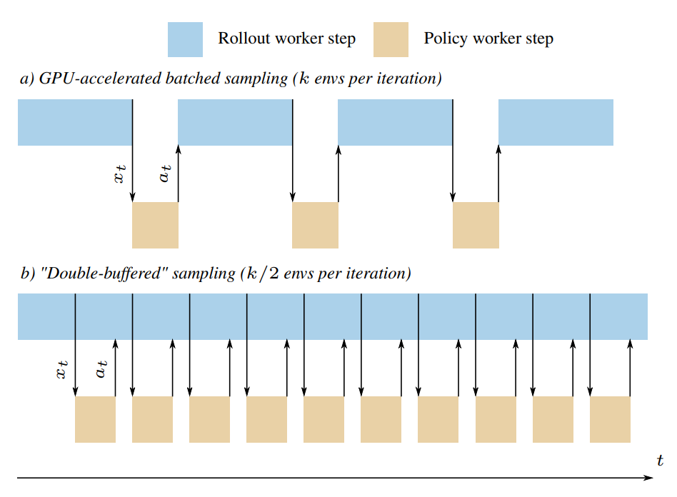

# Double-Buffered Sampling

Sample Factory supports accelerated sampling regime called **double-buffered sampling** which
can be enabled by setting `--worker_num_splits=2` (default value) and `--num_envs_per_worker` to a multiple of 2.

Note that this feature is independent of sync/async or batched/non-batched mode and can be used in any configuration.

## Explanation

Experience collection in RL is normally a sequential process.
We can't collect the next observation until we generate an action based on the current observation.

This means that for CPU-based environments we can't use our CPU cores when we're waiting for 
the inference to finish. This is a waste of resources and it slows down training.

Double-buffered sampling solves this problem by simulating 2*N environments serially in the same process.
While we're waiting for the inference to finish on the first N environments, we can already collect
observations from the next N environments.

The diagram below shows how this works:

Additionally, take a look at this animation that demonstrates double-buffered sampling: https://www.youtube.com/watch?v=0AyaeLqXQc4

