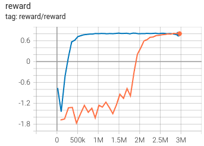

# Observation and Return Normalization

Neural networks are known to perform better when the input data and prediction targets are normalized.

Sample Factory provides normalization for observations and returns.
Normalization works by collecting running mean and standard deviation statistics of the data
for the entire training process, and then using these statistics to normalize the data to approximately zero mean and unit variance.

This way of normalization has proven more effective than per-batch normalization
since it changes the statistics slowly and smoothly as observations and returns change, and thus allows the networks to adapt to the new statistics.

## Observation normalization

Enable observation normalization by setting `--normalize_input` to `True`.
If your environment provides dictionary observations, you can specify which keys to normalize by setting `--normalize_input_keys key1 key2 key3`
(defaults to all keys).

Observation normalization in some cases can massively improve sample efficiency.
I.e. below is VizDoom "doom_basic" environment with (blue) and without (orange) observation normalization:

## Return normalization

Enable return normalization by setting `--normalize_returns` to `True`.
In addition to stabilizing training and reducing the critic loss, return normalization 
eliminates the need for careful tuning of reward scaling.

In the example below we train an agent on a relatively complex continuous control task, and the
version with return normalization not only trains faster, but also consistently reaches much higher reward.

There's no guarantee that normalization of observations and returns will always help, experiment
with your environment to see if it helps.

## Advantage normalization

In addition to observation and return normalization, Sample Factory also normalizes advantages.
Unlike observation and return normalization, advantage normalization is not based on running statistics,
but instead uses per-batch statistics. We found that this configuration performs well in many different domains.